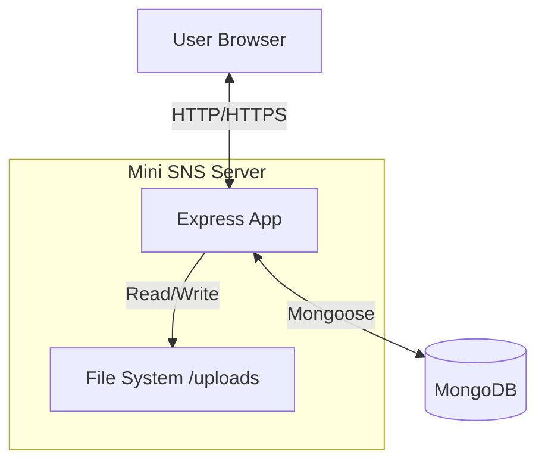
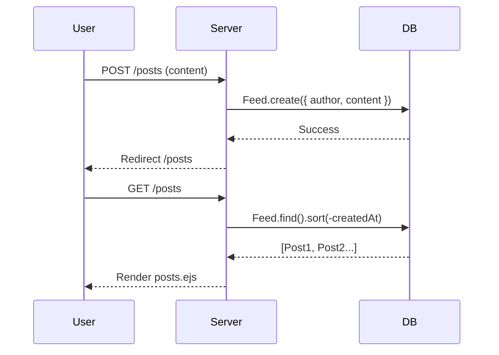
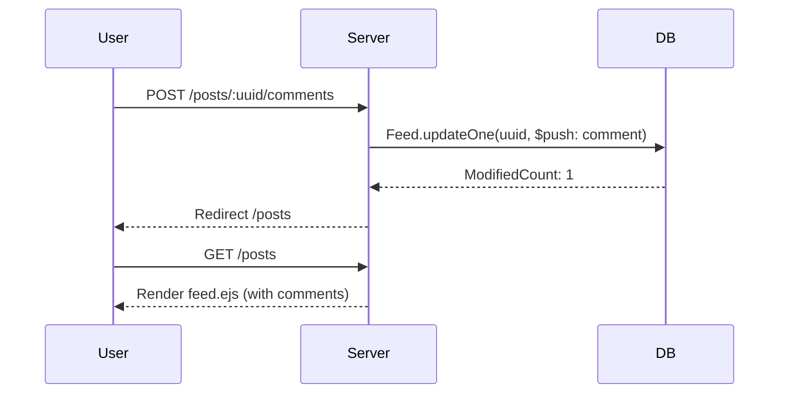
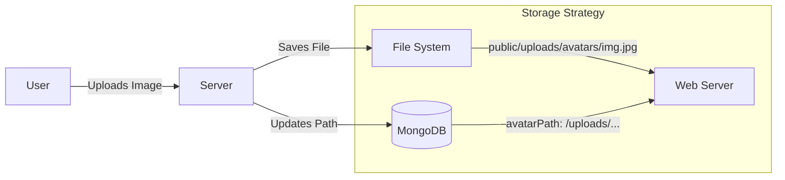

# Architecture & Database Design

This document provides an in-depth look at Mini SNS's system architecture, database schema, and data flow patterns.

## Table of Contents

- [System Overview](#system-overview)
- [Database Design](#database-design)
- [Data Flow](#data-flow)
- [Authentication](#authentication)
- [File Storage](#file-storage)
- [Deployment](#deployment)
- [Security Considerations](#security-considerations)

---

## System Overview

Mini SNS follows a traditional **MVC-like architecture**:

- **Models** (`models/`) - MongoDB schemas using Mongoose
- **Views** (`views/`) - EJS templates for server-side rendering
- **Controllers** - Route handlers in `app.js`

### System Context Diagram



### Technology Stack

| Layer          | Technology                  |
| :------------- | :-------------------------- |
| **Runtime**    | Node.js (LTS)               |
| **Framework**  | Express 5.1.0               |
| **Database**   | MongoDB 6.0+ (local)        |
| **ODM**        | Mongoose 9.0.0              |
| **Templating** | EJS 3.1.10                  |
| **Sessions**   | express-session + in-memory |
| **Uploads**    | Multer 2.0.2                |

---

## Database Design

MongoDB connection: `mongodb://localhost:27017/mydb`

### Collections

#### `users`

Stores user accounts and profile information.

**Schema** (`models/user.js`):

```javascript
{
  username: String (required, unique),
  password: String (required),      // Plain text (TODO: bcrypt)
  avatarPath: String (nullable),    // e.g., "/uploads/avatars/user_12345.jpg"
  redirect: String (default: "/posts")
}
```

**Indexes:**

- `username` (unique)

**Notes:**

- Passwords are currently stored in plain text. **Security improvement needed**: Implement bcrypt hashing.
- `avatarPath` stores the web-accessible path, not the file itself.

---

#### `feed`

Stores posts and their comments.

**Schema** (`models/feed.js`):

```javascript
{
  uuid: String (required, unique),   // Generated via uuid v4
  content: String (required),        // Post text
  author: String (required),         // Username of post creator
  comments: [                        // Embedded comment subdocuments
    {
      content: String (required),
      author: String (required),
      createdAt: Date (default: now)
    }
  ],
  createdAt: Date (default: now)
}
```

**Indexes:**

- `uuid` (unique, auto-generated)

**Design Decisions:**

- **Embedded Comments**: Comments are stored as subdocuments within posts for simplicity and atomic updates.
- **Author as String**: Currently stores username directly. Could be converted to ObjectId reference for relational integrity.

---

## Data Flow

### Post Creation Flow



### Comment Flow



### Profile Avatar Flow



---

## Authentication

### Login Process

```
POST /login
    ↓
User.findOne({ username, password })
    ↓
If found:
  - req.session.username = user.username
  - req.session.avatarPath = user.avatarPath
  - Redirect to user.redirect (default: /posts)
    ↓
If not found:
  - req.session.loginError = "Invalid credentials"
  - Redirect to /
```

### Session Management

- **Storage**: In-memory (resets on server restart)
- **Cookie**: `connect.sid` (HttpOnly)
- **Expiration**: 10 minutes of inactivity
- **Protected Routes**: Check `req.session.username` existence

**Security Notes:**

- No HTTPS enforcement (development only)
- No CSRF protection
- No rate limiting on login attempts

---

## File Storage

### Profile Pictures

**Storage Location**: `public/uploads/avatars/`

**Naming Convention**: `{username}_{timestamp}_{random}.{ext}`

**Validation**:

- **Max Size**: 2MB
- **Allowed Types**: `jpeg`, `jpg`, `png`, `webp`

**Database Reference**:

- Only the **path** is stored in MongoDB (`avatarPath` field)
- Actual file remains on filesystem

**Deletion**:

1. Physical file deleted via `fs.unlinkSync()`
2. Database field set to `null`

### Post Images

**Status**: Not yet implemented

**Planned**: Extend Feed schema with `imagePath` field, similar to avatar approach.

---

## Data Migration & Seeding

On application startup, if the `users` collection is empty:

```javascript
async function seedUsers() {
  const count = await User.countDocuments();
  if (count === 0) {
    const users = JSON.parse(fs.readFileSync("data/users.json"));
    await User.insertMany(users);
    console.log("Users seeded from JSON file.");
  }
}
```

This allows seamless migration from the old JSON-based persistence.

---

---

## Deployment

### Requirements

- **OS**: Linux (Ubuntu 20.04+ recommended), macOS, or Windows Server
- **Node.js**: v18.0.0 or higher
- **MongoDB**: v6.0 or higher
- **Reverse Proxy**: Nginx or Apache (recommended for SSL termination)

### Production Setup Steps

1. **Environment Variables**:
   Create a `.env` file (requires `dotenv` package installation):

   ```env
   PORT=4000
   MONGODB_URI=mongodb://localhost:27017/mydb
   SESSION_SECRET=complex_random_string_here
   NODE_ENV=production
   ```

2. **Process Management**:
   Use PM2 to keep the app running:

   ```bash
   npm install -g pm2
   pm2 start app.js --name "mini-sns"
   pm2 save
   ```

3. **Nginx Configuration (Example)**:

   ```nginx
   server {
       listen 80;
       server_name example.com;

       location / {
           proxy_pass http://localhost:4000;
           proxy_http_version 1.1;
           proxy_set_header Upgrade $http_upgrade;
           proxy_set_header Connection 'upgrade';
           proxy_set_header Host $host;
           proxy_cache_bypass $http_upgrade;
       }
   }
   ```

---

## Security Considerations

### Current Measures

- **Input Sanitization**: Basic trimming on inputs.
- **Session Security**: HttpOnly cookies prevent XSS access to session ID.

### Critical Missing Features (TODO)

1. **CSRF Protection**: Currently vulnerable to Cross-Site Request Forgery.
   - _Fix_: Implement `csurf` middleware.
2. **Password Hashing**: Passwords stored in plain text.
   - _Fix_: Use `bcrypt` to hash passwords before saving.
3. **Helmet**: HTTP headers are not secured.
   - _Fix_: Use `helmet` middleware to set security headers.
4. **Rate Limiting**: No protection against brute force.
   - _Fix_: Use `express-rate-limit`.

---

## Future Improvements

### Database

- [ ] Add indexes on `feed.author` for faster profile queries
- [ ] Convert `author` fields to ObjectId references
- [ ] Implement soft deletes (add `deletedAt` field)

### Security

- [ ] Hash passwords with bcrypt
- [ ] Implement CSRF tokens
- [ ] Add rate limiting (express-rate-limit)
- [ ] Use environment variables for MongoDB URI

### Performance

- [ ] Implement pagination for feeds
- [ ] Add caching layer (Redis) for sessions
- [ ] Optimize queries with `.lean()` for read-only operations
