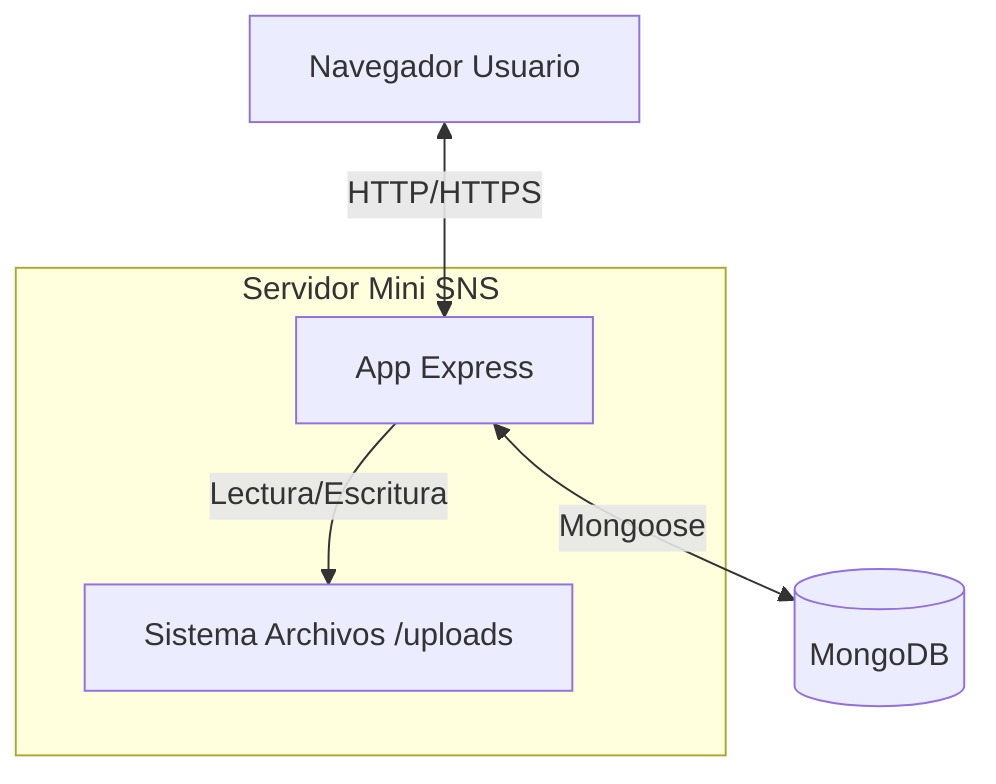
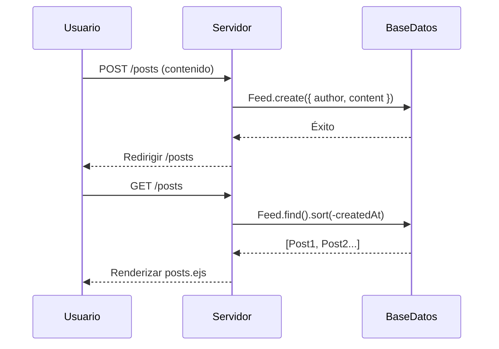
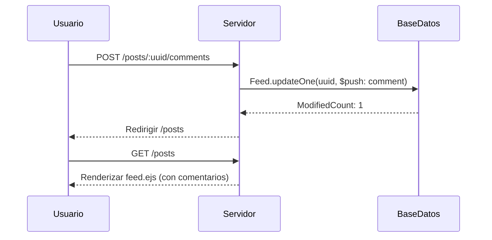
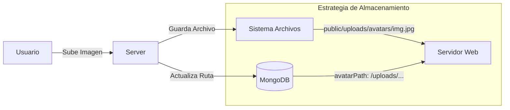

# Arquitectura y Diseño de Base de Datos

Este documento proporciona una visión detallada de la arquitectura del sistema Mini SNS, esquema de base de datos y patrones de flujo de datos.

## Tabla de Contenidos

- [Resumen del Sistema](#resumen-del-sistema)
- [Diseño de Base de Datos](#diseño-de-base-de-datos)
- [Flujo de Datos](#flujo-de-datos)
- [Autenticación](#autenticación)
- [Almacenamiento de Archivos](#almacenamiento-de-archivos)
- [Despliegue](#despliegue)
- [Consideraciones de Seguridad](#consideraciones-de-seguridad)

---

## Resumen del Sistema

Mini SNS sigue una **arquitectura tipo MVC**:

- **Modelos** (`models/`) - Esquemas MongoDB usando Mongoose
- **Vistas** (`views/`) - Plantillas EJS para renderizado del lado del servidor
- **Controladores** - Manejadores de rutas en `app.js`

### Diagrama de Contexto del Sistema



### Stack Tecnológico

| Capa           | Tecnología                   |
| :------------- | :--------------------------- |
| **Runtime**    | Node.js (LTS)                |
| **Framework**  | Express 5.1.0                |
| **Base Datos** | MongoDB 6.0+ (local)         |
| **ODM**        | Mongoose 9.0.0               |
| **Plantillas** | EJS 3.1.10                   |
| **Sesiones**   | express-session + en memoria |
| **Subidas**    | Multer 2.0.2                 |

---

## Diseño de Base de Datos

Conexión MongoDB: `mongodb://localhost:27017/mydb`

### Colecciones

#### `users`

Almacena cuentas de usuario e información de perfil.

**Esquema** (`models/user.js`):

```javascript
{
  username: String (requerido, único),
  password: String (requerido),      // Texto plano (TODO: bcrypt)
  avatarPath: String (nullable),     // ej., "/uploads/avatars/user_12345.jpg"
  redirect: String (default: "/posts")
}
```

**Índices:**

- `username` (único)

**Notas:**

- Las contraseñas se almacenan actualmente en texto plano. **Mejora de seguridad necesaria**: Implementar hash bcrypt.
- `avatarPath` almacena la ruta web accesible, no el archivo en sí.

---

#### `feed`

Almacena publicaciones y sus comentarios.

**Esquema** (`models/feed.js`):

```javascript
{
  uuid: String (requerido, único),   // Generado vía uuid v4
  content: String (requerido),       // Texto de la publicación
  author: String (requerido),        // Nombre de usuario del creador
  comments: [                        // Subdocumentos de comentarios embebidos
    {
      content: String (requerido),
      author: String (requerido),
      createdAt: Date (default: ahora)
    }
  ],
  createdAt: Date (default: ahora)
}
```

**Índices:**

- `uuid` (único, auto-generado)

**Decisiones de Diseño:**

- **Comentarios Embebidos**: Los comentarios se almacenan como subdocumentos dentro de las publicaciones para simplicidad y actualizaciones atómicas.
- **Author como String**: Actualmente almacena el nombre de usuario directamente. Podría convertirse a referencia ObjectId para integridad relacional.

---

## Flujo de Datos

### Flujo de Creación de Publicación



### Flujo de Comentarios



### Flujo de Avatar de Perfil



---

## Autenticación

### Proceso de Login

```
POST /login
    ↓
User.findOne({ username, password })
    ↓
Si se encuentra:
  - req.session.username = user.username
  - req.session.avatarPath = user.avatarPath
  - Redirigir a user.redirect (default: /posts)
    ↓
Si no se encuentra:
  - req.session.loginError = "Credenciales inválidas"
  - Redirigir a /
```

### Gestión de Sesiones

- **Almacenamiento**: En memoria (se reinicia al reiniciar el servidor)
- **Cookie**: `connect.sid` (HttpOnly)
- **Expiración**: 10 minutos de inactividad
- **Rutas Protegidas**: Verificar existencia de `req.session.username`

**Notas de Seguridad:**

- Sin aplicación HTTPS (solo desarrollo)
- Sin protección CSRF
- Sin limitación de tasa en intentos de login

---

## Almacenamiento de Archivos

### Imágenes de Perfil

**Ubicación**: `public/uploads/avatars/`

**Convención de Nombres**: `{username}_{timestamp}_{random}.{ext}`

**Validación**:

- **Tamaño Máx**: 2MB
- **Tipos Permitidos**: `jpeg`, `jpg`, `png`, `webp`

**Referencia en Base de Datos**:

- Solo la **ruta** se almacena en MongoDB (campo `avatarPath`)
- El archivo real permanece en el sistema de archivos

**Eliminación**:

1. Archivo físico eliminado vía `fs.unlinkSync()`
2. Campo de base de datos establecido a `null`

---

## Migración y Semilla de Datos

Al iniciar la aplicación, si la colección `users` está vacía:

```javascript
async function seedUsers() {
  const count = await User.countDocuments();
  if (count === 0) {
    const users = JSON.parse(fs.readFileSync("data/users.json"));
    await User.insertMany(users);
    console.log("Usuarios sembrados desde archivo JSON.");
  }
}
```

Esto permite una migración sin problemas desde la persistencia basada en JSON.

---

---

## Despliegue

### Requisitos

- **SO**: Linux (Ubuntu 20.04+ recomendado), macOS, o Windows Server
- **Node.js**: v18.0.0 o superior
- **MongoDB**: v6.0 o superior
- **Proxy Inverso**: Nginx o Apache (recomendado para terminación SSL)

### Pasos de Configuración en Producción

1. **Variables de Entorno**:
   Crear un archivo `.env` (requiere instalar paquete `dotenv`):

   ```env
   PORT=4000
   MONGODB_URI=mongodb://localhost:27017/mydb
   SESSION_SECRET=cadena_aleatoria_compleja_aqui
   NODE_ENV=production
   ```

2. **Gestión de Procesos**:
   Usar PM2 para mantener la app en ejecución:

   ```bash
   npm install -g pm2
   pm2 start app.js --name "mini-sns"
   pm2 save
   ```

3. **Configuración Nginx (Ejemplo)**:

   ```nginx
   server {
       listen 80;
       server_name ejemplo.com;

       location / {
           proxy_pass http://localhost:4000;
           proxy_http_version 1.1;
           proxy_set_header Upgrade $http_upgrade;
           proxy_set_header Connection 'upgrade';
           proxy_set_header Host $host;
           proxy_cache_bypass $http_upgrade;
       }
   }
   ```

---

## Consideraciones de Seguridad

### Medidas Actuales

- **Sanitización de Entradas**: Recorte básico (trim) en entradas.
- **Seguridad de Sesión**: Cookies HttpOnly previenen acceso XSS al ID de sesión.

### Características Críticas Faltantes (TODO)

1. **Protección CSRF**: Actualmente vulnerable a Falsificación de Petición en Sitios Cruzados.
   - _Solución_: Implementar middleware `csurf`.
2. **Hash de Contraseñas**: Contraseñas almacenadas en texto plano.
   - _Solución_: Usar `bcrypt` para hashear contraseñas antes de guardar.
3. **Helmet**: Cabeceras HTTP no aseguradas.
   - _Solución_: Usar middleware `helmet` para establecer cabeceras de seguridad.
4. **Limitación de Tasa**: Sin protección contra fuerza bruta.
   - _Solución_: Usar `express-rate-limit`.

---

## Mejoras Futuras

### Base de Datos

- [ ] Agregar índices en `feed.author` para consultas de perfil más rápidas
- [ ] Convertir campos `author` a referencias ObjectId
- [ ] Implementar eliminaciones suaves (agregar campo `deletedAt`)

### Seguridad

- [ ] Hash de contraseñas con bcrypt
- [ ] Implementar tokens CSRF
- [ ] Agregar limitación de tasa (express-rate-limit)
- [ ] Usar variables de entorno para URI MongoDB

### Rendimiento

- [ ] Implementar paginación para feeds
- [ ] Agregar capa de caché (Redis) para sesiones
- [ ] Optimizar consultas con `.lean()` para operaciones de solo lectura
